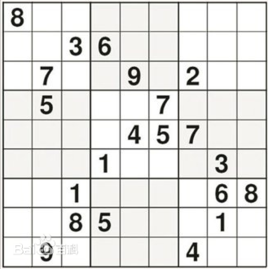

# 数独求解（非递归）

## 1 [数独技巧——候选数删减法](http://www.llang.net/sudoku/skill/2.html)

## 2 测试所用数独

### 0 模板

```python
sudoku = [[],
          [],
          [],
          [],
          [],
          [],
          [],
          [],
          []]
```

- [x] ### 1 容易

```python
[[0,0,0,8,0,5,0,1,3],
 [0,0,0,2,0,3,6,0,0],
 [6,0,0,0,9,0,2,0,4],
 [0,0,0,0,0,0,0,0,5],
 [0,4,0,1,0,0,7,0,6],
 [2,5,6,3,0,4,8,9,0],
 [5,9,0,0,0,7,1,0,2],
 [1,0,2,0,8,0,4,7,0],
 [0,0,4,9,1,0,0,3,8]]
```

```python
[[0,0,0,6,0,0,1,0,7],
 [6,8,0,9,5,1,3,0,0],
 [0,0,3,0,0,2,5,6,8],
 [0,4,0,8,1,0,0,2,0],
 [0,0,0,0,0,0,8,5,0],
 [0,9,0,0,6,5,0,7,3],
 [4,0,9,0,0,3,0,8,5],
 [1,6,2,0,0,9,0,3,0],
 [5,0,0,7,0,6,0,0,0]]
```


- [x] ### 2 中等

```python
[[8,0,0,1,0,0,0,7,0],
 [0,2,0,0,4,0,8,0,0],
 [0,6,0,7,0,0,0,0,0],
 [0,0,0,4,7,0,9,0,8],
 [2,4,0,0,8,0,0,0,0],
 [0,3,8,0,0,0,0,0,5],
 [0,8,0,6,0,4,1,0,0],
 [9,0,0,0,0,7,2,0,4],
 [0,0,5,8,1,0,0,0,6]]
```

```python
[[0,1,0,0,0,0,4,3,0],
 [7,0,0,0,0,0,0,0,0],
 [0,0,0,2,5,4,9,0,0],
 [1,7,0,0,4,0,2,0,6],
 [0,0,0,0,9,0,0,0,3],
 [0,0,3,0,0,6,0,8,0],
 [0,0,1,4,7,0,0,6,0],
 [0,0,0,5,0,8,1,2,0],
 [0,9,0,0,6,0,3,0,4]]
```

```python
[[0,0,0,4,0,0,2,0,0],
 [0,0,2,0,0,0,0,1,8],
 [5,0,6,9,0,0,0,3,0],
 [0,6,9,0,0,0,3,0,0],
 [0,5,0,0,0,0,0,2,1],
 [8,0,0,1,5,7,6,0,9],
 [0,0,0,0,3,0,9,6,0],
 [9,0,0,6,0,2,0,5,0],
 [0,0,0,0,0,0,7,0,2]]
```


- [x] ### 3 困难

```python
[[0,0,4,8,6,0,0,3,0],
 [0,0,1,0,0,0,0,9,0],
 [8,0,0,0,0,9,0,6,0],
 [5,0,0,2,0,6,0,0,1],
 [0,2,7,0,0,1,0,0,0],
 [0,0,0,0,4,3,0,0,6],
 [0,5,0,0,0,0,0,0,0],
 [0,0,9,0,0,0,4,0,0],
 [0,0,0,4,0,0,0,1,5]]
```

```python
[[0,0,0,0,6,8,0,3,0],
 [1,9,0,0,0,0,0,0,0],
 [8,0,3,1,0,0,2,0,0],
 [4,0,0,0,5,1,0,6,0],
 [7,0,0,0,2,0,0,0,4],
 [0,0,0,0,7,0,8,0,0],
 [0,1,0,0,0,5,0,0,7],
 [0,0,4,0,0,0,0,0,0],
 [0,5,0,0,3,0,1,0,0]]
```


- [ ] ### 4 专家级(部分可解)

```python
[[0,0,0,4,0,0,0,0,0],
 [5,6,1,0,0,0,0,7,3],
 [0,0,9,0,0,0,0,0,1],
 [8,3,0,0,0,0,6,0,4],
 [0,4,0,0,9,0,8,0,0],
 [0,9,0,2,0,0,0,0,0],
 [0,0,0,6,0,0,0,3,5],
 [0,0,0,5,0,0,0,0,0],
 [0,0,0,0,3,0,9,0,0]]
```

```python
[[3,0,0,0,0,9,8,0,1],
 [0,0,6,0,0,0,0,0,9],
 [8,0,0,0,7,0,0,0,0],
 [0,0,0,4,0,0,0,0,0],
 [5,0,0,0,0,0,0,6,0],
 [0,7,0,0,8,0,1,3,0],
 [0,1,0,0,0,0,4,0,0],
 [0,0,0,2,0,3,9,0,0],
 [0,5,4,0,0,1,0,0,0]]
```


#### 不可解

```python
[[0,6,0,4,0,0,0,0,8],
 [1,0,0,0,0,3,0,0,0],
 [0,0,0,0,2,0,5,0,0],
 [0,0,0,6,0,0,0,0,4],
 [6,0,0,8,0,0,2,0,0],
 [0,0,7,0,0,0,0,0,3],
 [0,0,0,1,0,0,0,0,0],
 [7,5,3,0,0,0,1,0,0],
 [2,1,0,0,9,6,0,0,0]]
```


```
    arr = np.array([[0,0,9,0,0,0,1,0,0],
                    [0,6,0,0,0,0,0,8,0],
                    [5,0,0,0,0,0,0,4,6],
                    [0,0,0,0,0,0,0,0,0],
                    [6,8,7,0,0,3,0,0,0],
                    [0,0,0,0,0,5,4,0,2],
                    [0,4,0,0,0,9,0,1,0],
                    [0,0,6,0,0,0,3,0,0],
                    [8,9,0,0,7,4,0,0,0]])
```


```
    arr = np.array([[9,6,0,0,0,0,0,0,0],
                    [0,0,0,0,4,2,0,0,3],
                    [0,0,0,0,0,0,0,9,8],
                    [4,0,0,2,0,0,0,0,0],
                    [0,1,8,0,7,0,0,0,0],
                    [0,0,3,0,0,9,0,0,0],
                    [0,3,1,0,0,8,0,6,0],
                    [6,0,0,0,0,5,0,0,0],
                    [0,2,0,0,0,1,4,0,0]])
```


```
    arr = np.array([[0,0,9,6,0,0,0,0,0],
                    [0,0,0,7,4,3,0,0,0],
                    [0,0,0,0,0,0,0,4,0],
                    [0,0,7,0,2,0,0,5,0],
                    [9,1,0,0,0,0,0,0,0],
                    [2,0,0,0,0,0,6,3,0],
                    [0,4,5,9,0,0,0,1,0],
                    [0,0,6,0,0,5,3,0,0],
                    [0,0,0,0,0,7,2,0,0]])
```


```
    arr = np.array([[0,8,0,0,3,0,0,0,6],
                    [0,5,0,0,4,9,3,0,0],
                    [0,0,0,0,0,0,0,0,0],
                    [0,0,0,4,0,0,0,0,1],
                    [7,0,0,2,0,8,0,0,0],
                    [1,0,6,0,0,0,0,4,0],
                    [0,7,8,0,0,2,0,0,0],
                    [0,0,0,0,0,0,2,0,9],
                    [4,0,9,0,0,5,0,0,0]])
                    answer第1宫和第二行会有矛盾
                    ABXYZ型
```


- [ ] ### 5 骨灰级

```python
[[8, 0, 0, 0, 0, 0, 0, 0, 0],
 [0, 0, 3, 6, 0, 0, 0, 0, 0],
 [0, 7, 0, 0, 9, 0, 2, 0, 0],
 [0, 5, 0, 0, 0, 7, 0, 0, 0],
 [0, 0, 0, 0, 4, 5, 7, 0, 0],
 [0, 0, 0, 1, 0, 0, 0, 3, 0],
 [0, 0, 1, 0, 0, 0, 0, 6, 8],
 [0, 0, 8, 5, 0, 0, 0, 1, 0],
 [0, 9, 0, 0, 0, 0, 4, 0, 0]]
```




